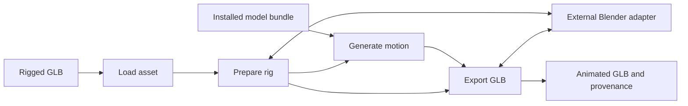

# ComfyUI-UniMate design

Date: 2026-09-30. Status: proposed; implementation has not started.

## Purpose and success criteria

Give ComfyUI users a reproducible route from an already-rigged character and a motion prompt to an animated GLB usable in Blender and a glTF viewer. This complements mesh generation and texturing; automatic rigging remains a separate step.

The first release succeeds when a supported rest-only GLB can be prepared, animated, and exported without a training dataset or existing animation clip. The exported character must retain its appearance, skinning, rest pose, and source coordinate frame. A second rig with a different topology must pass the same workflow without per-rig training.

User-requested deliverables are a new MIT repository, README.md, AGENTS.md, and this design. The assumptions below define a proposed first release, not a commitment that support already exists.

## Approach

Use a custom node pack with in-process inference and an external Blender adapter. Keep typed rig and motion values separate from ordinary ComfyUI MESH values.

Alternatives considered:

| Approach | Benefit | Cost |
| --- | --- | --- |
| Custom pack with Blender adapter (selected) | Integrates with ComfyUI execution while reusing upstream rig math | Requires an explicit Blender installation and inference adapter |
| CLI wrapper around the entire upstream pipeline | Fastest reference prototype; isolates all dependencies | Poor model reuse, coarse cancellation/progress, dataset-oriented interface |
| Native core integration | Potentially shared model and animation infrastructure | Requires new core rig contracts and a much broader maintenance commitment |

Use the CLI pipeline as a reference during development, not as the shipping node interface. Avoid a frontend extension in the first release; exported GLBs provide the initial playback review.

## Source baseline and evidence

Inspect and pin UniMate commit `5d6aabedd947297b5ba6706d8e9113e68c0c3e4f`. Record the exact dependency revision in the implemented package; do not install a floating main branch.

Relevant sources:

- [Inference entry point](https://github.com/Friedrich-M/UniMate/blob/5d6aabedd947297b5ba6706d8e9113e68c0c3e4f/unimate/inference/sample.py): config, checkpoint/EMA loading, text encoding, normalization, dataset-oriented sampling.
- [Sample generation](https://github.com/Friedrich-M/UniMate/blob/5d6aabedd947297b5ba6706d8e9113e68c0c3e4f/unimate/inference/generate.py): flow sampling and guidance.
- [Character preprocessing](https://github.com/Friedrich-M/UniMate/blob/5d6aabedd947297b5ba6706d8e9113e68c0c3e4f/data_process/mesh_animation/preprocess_char.py): `cond_from_rest`, canonical skeleton construction, and canonical asset baking.
- [Mesh animation](https://github.com/Friedrich-M/UniMate/blob/5d6aabedd947297b5ba6706d8e9113e68c0c3e4f/data_process/mesh_animation/animate_motion.py): feature decoding and driving a rigged asset.
- [Model card](https://huggingface.co/Linzhan/UniMate): released model variants, feature format, and limits. Pin the Hub revision of each installed artifact during implementation.

The model card says a new rig needs an animation clip. The inspected code includes a rest-only fallback that retains the full armature. Treat rest-only preparation as a code-backed capability requiring verification. Do not prune bones based on fabricated motion.

The v2 model emits 60 frames at 30 fps with 12 features per joint. Its training range is 5–70 joints; the documented sampler ceiling can differ by one. For the first release enforce 5–70 prepared joints and reject larger rigs with an actionable message. Supporting a technical ceiling above the training range is a later decision.

## First-release boundaries

Support one self-contained GLB with one skin and one connected deforming skeleton; multiple mesh primitives attached to that skin are allowed. Support triangle primitives, linear-blend skinning, standard PBR materials, and embedded textures. Preserve non-joint transform ancestors in the asset mapping.

Reject multiple skins, disconnected skeletons, unsupported extensions, morph targets, compressed geometry, joint shear, negative joint scale, and animated or nonuniform joint scale. Do not silently drop unsupported content. Static scene transforms are supported only when they can be represented and reversed by the adapter. The preparation gate must reject assets outside that proven subset.

Source animation is ignored for generation and omitted from the output; export contains one newly generated clip. Preparation uses the bind/rest pose, not the currently evaluated pose or first animation frame. Users explicitly choose a facing direction: source +Z, source -Z, source +X, source -X, or a left/right joint pair. Do not infer anatomical orientation through a network service.

FBX, automatic rigging, multi-character scenes, retargeting, foot-contact cleanup, physics, mesh previews, and motion editing are deferred. Output motion can be imperfect; avoid claims of production-ready animation quality.

## Nodes and sockets

Use ComfyUI's current `ComfyExtension`/`io.ComfyNode` API after verifying the target checkout. IDs below are stable public contracts; display names may be clearer than IDs. Category: `3D/UniMate`.

| ID / display name | Inputs | Outputs and behavior |
| --- | --- | --- |
| `UniMateLoadRig` / Load Rigged GLB | `asset`: GLB selected from permitted input files | `UNIMATE_ASSET`; inspect and validate a rigged source asset without loading a model |
| `UniMatePrepareRig` / Prepare UniMate Rig | `asset`; `facing`: enum; optional `left_joint`, `right_joint` required only for pair mode | `UNIMATE_RIG`; canonical conditioning, original-to-prepared mapping, and source asset reference |
| `UniMateModelLoader` / Load UniMate Model | `bundle`: installed bundle selection | `UNIMATE_MODEL`; selected denoiser, EMA weights, normalization, config, tokenizer and text encoder |
| `UniMateGenerateMotion` / Generate UniMate Motion | `model`, `rig`, `prompt`: multiline string; `seed`: unsigned 64-bit integer; `guidance`: float, default 3.0, range 1.0–10.0 | `UNIMATE_MOTION`; one fixed 60-frame clip at 30 fps |
| `UniMateExportGLB` / Export UniMate GLB | `rig`, `motion`; `filename_prefix`: default `unimate/animation` | Output node writes an animated GLB and provenance JSON in ComfyUI output; returns file metadata through the verified output API |

Do not expose a steps control until its exact correspondence to the upstream ODE solver is verified. First-release sampling uses the selected bundle's recorded solver settings. No arbitrary duration, fps, batch, or rig-pruning controls in the first version. A generation node generates motion only; it does not re-emit its inputs.

## Data contracts

In-memory values are immutable records; persisted payloads use versioned JSON manifests and numeric NPZ files with `allow_pickle=False`. Arrays use explicit shapes, dtypes, and coordinate conventions. Values are not interchangeable with generic MESH sockets.

### UNIMATE_ASSET v1

Contains the managed source path, SHA-256 content digest, scene/skin selection, joint node indices, original joint names, and a validated capability report. Embedded buffers and textures stay associated with the source. Source digest changes invalidate downstream caches. Do not accept arbitrary absolute paths from a prompt.

### UNIMATE_RIG v1

Contains the source digest; original joint/node identity and parent mapping; rest local transforms and inverse bind matrices; breadth-first prepared ordering and inverse permutation; canonical joint names; canonical rest positions and rotations; topology conditioning; and the reversible source/canonical coordinate and scale mapping. Record explicit quaternion component order at every adapter boundary.

Compute `rig_id` from source digest, conditioning arrays, mapping, facing choice, adapter version, and pinned upstream revision. Include the original transform hierarchy needed to reconstruct the asset. No bone pruning in the first release. Derive normalization and topology fields using the upstream reference; do not guess their values.

The Blender adapter may create a canonical intermediate, but that intermediate is not the final output. Validate any rebinding by comparing deformed vertices before and after preparation. Retain the mapping required to apply motion to the original asset in its original frame.

### UNIMATE_MODEL v1

Contains a lazy managed model handle, config, normalization statistics, selected checkpoint digest, EMA selection, text encoder/tokenizer identities, solver settings, and supported shape limits. No provider credentials or user workflow state. A bundle manifest identifies all files and their hashes; conflicting config/statistics/checkpoint combinations fail before sampling.

### UNIMATE_MOTION v1

Contains unnormalized float32 features `[60, J, 12]` in upstream canonical convention, `rig_id`, fps 30, prompt, seed, guidance, solver settings, model/text encoder digests, and adapter revision. Validate finite values and joint count. Root features have distinct semantics from non-root joint features; decode them through the pinned upstream recovery functions.

## Runtime architecture



Suggested implementation layout, created only when implementation is requested:

```text
__init__.py                 ComfyUI extension registration
nodes.py                    Node schemas and delegation
unimate_pack/contracts.py   Typed asset, rig, model, and motion records
unimate_pack/assets.py      Managed paths and asset validation
unimate_pack/blender.py     Subprocess lifecycle and checked request/response files
unimate_pack/blender_job.py Blender-side preparation and export entry point
unimate_pack/inference.py   Model management, conditioning, sampling, and cancellation
unimate_pack/upstream.py    Narrow pinned upstream adapter
tests/                     Contract, reference, Blender, and GPU integration checks
```

This layout expresses ownership; split files further only when needed. Avoid a general-purpose plugin framework.

### Rig preparation and export

Configure an explicit Blender executable once in local pack settings; resolve an existing executable without running a shell command. Launch with background mode, factory settings, and automatic Python execution disabled. Pass a generated job JSON path as an argument. Never pass user text as executable Python.

Use separate working directories per job under ComfyUI's managed temporary directory. The worker imports the GLB, builds the same canonical conditioning as upstream's rest-only path, and returns safe numeric arrays plus mapping metadata. Convert legacy object-based upstream data inside this trusted process; do not expose a pickled conditioning file as a user input.

Export checks motion/rig identity, decodes rotations and root motion using upstream math, reverses preparation transforms, and animates the original hierarchy. The final GLB keeps rest transforms, inverse bind matrices, joint names, weights, textures, and materials. If Blender changes representation, prove semantic equivalence rather than requiring identical bytes.

First-release rotation export uses quaternions with hemisphere continuity and linear glTF interpolation; translation uses linear interpolation. Store 60 sample keys at times `i / 30`, for `i=0..59`. There is no synthesized loop-closing frame or claim of seamless looping. Preserve root displacement rather than silently forcing motion in place.

### Inference and dependency handling

The upstream requirements combine training, captioning, rendering, Blender, and inference. Do not install that file wholesale. Identify the inference-only import closure and make any upstream packaging adjustments explicit and reviewable. Audit licenses of transitive animation utilities before vendoring or installing them.

Use a local bundle under a registered `models/unimate` folder and a local text encoder. Loading validates all artifacts and chooses EMA deliberately. Restricted checkpoint loading must succeed or an explicit trusted conversion step must produce a safe inference bundle. Do not deserialize arbitrary uploaded checkpoints or silently use unsafe loading.

Let ComfyUI select execution devices and unload/offload models. Validate that the denoiser and text encoder can participate in the target checkout's model management before freezing dependencies. Prefer float32 for reference correctness first; add lower precision only with numeric and output comparisons. CUDA is the first required accelerated backend; CPU is a correctness target with no speed promise. Other devices remain unclaimed until tested.

Text and joint-name encoding must run locally. Adapt the upstream sampler to accept prepared conditioning directly rather than constructing a training dataset directory. Reproduce upstream normalization, masks, topology features, and guidance. Cache embeddings by text, joint vocabulary, tokenizer/encoder identity, and normalization behavior.

Report progress and check interruption between solver evaluations and preprocessing stages. Cancel and reap Blender processes, release owned tensors, and clean temporary files after failure. Use a local RNG for seed isolation; reproducibility is within a recorded runtime, not across every device and torch release.

## Caching, paths, and failures

Cache prepared rigs by `rig_id`; cache model handles by complete bundle identity. Never key file caches only by a filename. Keep GPU tensors out of persisted rig caches. Reuse valid prepared data after a restart; write caches atomically.

Resolve filenames with ComfyUI's current path helpers, reject traversal and escapes, and generate unique output names. A successful export publishes both GLB and provenance only after validation; partial files stay temporary. Provenance contains generation settings and content digests, without absolute local paths, secrets, or machine identity.

Errors identify the failed stage and a concrete remedy: missing Blender, missing local text encoder, unsupported rig scale, excess joints, corrupt bundle, mismatched motion, or failed export. Bound diagnostic output; keep full process logs local. Do not swallow a failed generation and return an empty clip.

## Verification and release gates

1. **Reference feasibility:** run the pinned upstream rest-only path on two redistributable GLBs of different topology. Produce conditioning and animate them without a training dataset. Compare the proposed inference-only adapter to an upstream reference run. A failure blocks advertising arbitrary new-rig input.
2. **Rig round trip:** synthetic two-joint math fixtures test ordering and transforms independently of model limits; supported 5+ joint fixtures test preparation. Identity motion must preserve rest geometry and skinning. Check translated/scaled scene roots, facing choices, and a nonidentity bind pose. Unsupported scale/shear must fail explicitly.
3. **Motion parity:** compare topology fields, normalization, text/joint embeddings, sampled features, and recovered FK against the pinned reference at fixed seed and float32. Record tolerances appropriate to each operation before declaring parity. Check root trajectories and bone lengths, not just tensor shapes.
4. **Export playback:** load the exported GLB in Blender and an independent glTF viewer. Inspect all frames, joint hierarchy, root displacement, material/texture appearance, and skinned vertex positions. Verify key timestamps and quaternion continuity. A same-rig identity hash mismatch must fail before writing.
5. **ComfyUI integration:** run an API-format workflow from input to output. Check repeated execution, file-content changes, model unload/reload, cancellation during generation and Blender work, missing artifacts, and paths with spaces/non-ASCII characters.
6. **Release evidence:** test Windows and Linux with recorded ComfyUI, Blender, upstream, model revision, torch, device, and precision. Publish measured peak VRAM and latency for those environments only. Ship a workflow and a redistributable sample rig once these gates pass.

Reject corrupt buffers, invalid skin indices, nonfinite values, cyclic parents, oversized inputs, and output path escapes in dependency-light tests. Blender and GPU checks are marked integration tests; documentation-only changes do not require launching those runtimes.

## Implementation sequence

Each milestone is independently reviewable and ends with the evidence described above. This is a roadmap, not an approved code implementation plan.

1. Prove rest-only preparation and export against upstream; pin dependency versions and record fixture licenses. This resolves the primary feasibility risk before node work.
2. Implement safe contracts and the Blender adapter. Deliver identity-motion round trips and malformed-input rejection.
3. Implement managed model loading and direct-conditioning inference. Deliver reference parity, offline operation, cancellation, and unload evidence.
4. Register the five nodes and wire managed paths, caching, progress, and atomic outputs. Deliver a working ComfyUI workflow.
5. Validate playback and quality on two topologies, document hardware evidence, and publish the first usable release.

If importing a new rig requires rebuilding the entire dataset, or export cannot reverse canonicalization accurately, stop and revise the adapter design. Do not hide those failures behind an installation guide.

## Later extensions

Motion preview can render an IMAGE batch or add a frontend viewer once its cost and animation support are understood. Motion import plus frame/joint constraints can expose upstream in-betweening and editing. Expansion can chain fixed windows while preserving root continuity. These need separate contracts and acceptance tests.

Cloud Offload support is deferred. The sibling pack's protocol would need safe versioned rig/motion transport and installed Blender/model capabilities on the runner. Do not assume static mesh bundles preserve skins or animations. Native core integration should be considered only after these contracts prove useful beyond this pack.
