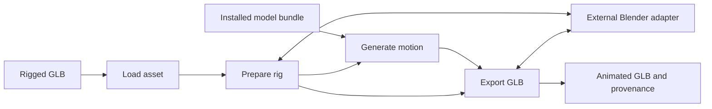

# ComfyUI-UniMate design

Date: 2026-09-30. Status: implemented; release verification remains incomplete. See [VALIDATION.md](VALIDATION.md).

## Purpose and success criteria

Expose UniMate's technology through usable ComfyUI nodes. [COVERAGE.md](COVERAGE.md) maps released inference, models, preprocessing, training and paper-described capabilities to current support and remaining work. The existing rigged-GLB generation/export path is incomplete coverage. Automatic rigging is an adjacent input technology, not a UniMate capability.

The first release succeeds when a supported rest-only GLB can be prepared, animated, and exported without a training dataset or existing animation clip. The exported character must retain its appearance, skinning, rest pose, and source coordinate frame. A second rig with a different topology must pass the same workflow without per-rig training.

Implementation was authorized on 2026-09-30, including mandatory Cloud Offload partitions. The constraints below describe the implemented architecture and remaining release gates.

## Approach

Use a custom node pack with in-process inference and an external Blender adapter. Keep portable versioned rig and motion dictionaries separate from ordinary ComfyUI MESH values.

Alternatives considered:

| Approach | Benefit | Cost |
| --- | --- | --- |
| Custom pack with Blender adapter (selected) | Integrates with ComfyUI execution while reusing upstream rig math | Requires an explicit Blender installation and inference adapter |
| CLI wrapper around the entire upstream pipeline | Fastest reference prototype; isolates all dependencies | Poor model reuse, coarse cancellation/progress, dataset-oriented interface |
| Native core integration | Potentially shared model and animation infrastructure | Requires new core rig contracts and a much broader maintenance commitment |

Use the CLI pipeline as a reference during development, not as the shipping node interface. Avoid a frontend extension in the first release; exported GLBs provide the initial playback review.

## Source baseline and evidence

UniMate source is pinned to `5d6aabedd947297b5ba6706d8e9113e68c0c3e4f`. Narrow MIT inference/topology/name utilities retain source hashes and notices. The full training environment and third-party Motion package are not distributed. The official v2 model revision is `387a344c3031299bc25fcbef35d36bd186d5afe7`; FLAN-T5-base is `7bcac572ce56db69c1ea7c8af255c5d7c9672fc2`.

Relevant sources:

- [Inference entry point](https://github.com/Friedrich-M/UniMate/blob/5d6aabedd947297b5ba6706d8e9113e68c0c3e4f/unimate/inference/sample.py): config, checkpoint/EMA loading, text encoding, normalization, dataset-oriented sampling.
- [Sample generation](https://github.com/Friedrich-M/UniMate/blob/5d6aabedd947297b5ba6706d8e9113e68c0c3e4f/unimate/inference/generate.py): flow sampling and guidance.
- [Character preprocessing](https://github.com/Friedrich-M/UniMate/blob/5d6aabedd947297b5ba6706d8e9113e68c0c3e4f/data_process/mesh_animation/preprocess_char.py): `cond_from_rest`, canonical skeleton construction, and canonical asset baking.
- [Mesh animation](https://github.com/Friedrich-M/UniMate/blob/5d6aabedd947297b5ba6706d8e9113e68c0c3e4f/data_process/mesh_animation/animate_motion.py): feature decoding and driving a rigged asset.
- [Model card](https://huggingface.co/Linzhan/UniMate): released model variants, feature format, and limits. Pin the Hub revision of each installed artifact during implementation.

The rest-only path retains the full armature. Synthetic five- and seven-joint fixtures passed pinned numeric comparisons and real ComfyUI generation/export without source clips. No bones are pruned. Real character quality and the full upstream preprocessing CLI remain unverified.

The v2 model emits 60 frames at 30 fps with 12 features per joint. Its training range is 5–70 joints; the documented sampler ceiling can differ by one. For the first release enforce 5–70 prepared joints and reject larger rigs with an actionable message. Supporting a technical ceiling above the training range is a later decision.

## First-release boundaries

Support one self-contained GLB with one skin and one connected deforming skeleton; multiple mesh primitives attached to that skin are allowed. Support triangle primitives, dense accessors, up to four linear-blend skin influences, standard PBR materials, and embedded PNG/JPEG textures. Preserve non-joint transform ancestors in the asset mapping. Sparse accessors, unskinned scene meshes, all glTF extensions, and nonuniform scale on any node are additionally rejected. GLBs are limited to 256 MiB; bounded image-header checks do not establish full codec conformance.

Reject multiple skins, disconnected skeletons, unsupported extensions, morph targets, compressed geometry, joint shear, negative joint scale, and animated or nonuniform joint scale. Do not silently drop unsupported content. Static scene transforms are supported only when they can be represented and reversed by the adapter. The preparation gate must reject assets outside that proven subset.

Source animation is ignored for generation and omitted from the output; export contains one newly generated clip. Preparation uses the bind/rest pose, not the currently evaluated pose or first animation frame. Users explicitly choose a facing direction: source +Z, source -Z, source +X, source -X, or a left/right joint pair. Do not infer anatomical orientation through a network service.

The boundaries below describe the existing implementation, not permanent scope exclusions. In-betweening, editing, expansion, additional model families, previews and export formats remain required coverage work. Text-mediated cross-topology transfer generates directly for each target skeleton. See COVERAGE.md for training and paper-only capability gaps. Output motion can be imperfect; avoid claims of production-ready animation quality.

## Nodes and sockets

The nodes use ComfyUI's current `ComfyExtension`/`io.ComfyNode` API, verified through the installed core loader. IDs below are stable public contracts. Category: `3D/UniMate`.

| ID / display name | Inputs | Outputs and behavior |
| --- | --- | --- |
| `UniMateLoadRig` / Load Rigged GLB | `asset`: GLB selected from permitted input files | `UNIMATE_ASSET`; inspect and validate a rigged source asset without loading a model |
| `UniMatePrepareRig` / Prepare UniMate Rig | `asset`; `facing`: enum; optional `left_joint`, `right_joint` required only for pair mode | `UNIMATE_RIG`; canonical conditioning, original-to-prepared mapping, and source asset reference |
| `UniMateModelLoader` / Load UniMate Model | `bundle`: installed bundle selection | `UNIMATE_MODEL`; selected denoiser, EMA weights, normalization, config, tokenizer and text encoder |
| `UniMateGenerateMotion` / Generate UniMate Motion | `model`, `rig`, `prompt`: multiline string; `seed`: unsigned 64-bit integer; `guidance`: float, default 3.0, range 1.0–10.0; `normalization`: `objaverse` (default), `mixamo`, or `truebones` | `UNIMATE_MOTION`; one fixed 60-frame clip at 30 fps |
| `UniMateExportGLB` / Export UniMate GLB | `rig`, `motion`; `filename_prefix`: default `unimate/animation` | Output node writes an animated GLB and provenance JSON in ComfyUI output; returns file metadata through the verified output API |

Sampling uses the bundle's recorded solver settings: `dopri5`, 50 recorded time points, `atol=1e-6`, `rtol=1e-3`. Normalization statistics differ by family and between root/local features. Guidance 1 is unconditional, matching upstream. There are no steps, duration, fps, batch, or rig-pruning controls. Generation emits motion only.

## Data contracts

Every socket value is a plain versioned dictionary. No local paths, live model objects, NumPy arrays, credentials, or custom Python classes cross a boundary. Callers treat values as immutable. Binary payloads are bytes; numeric/string arrays are NPZ loaded with `allow_pickle=False`. Arrays use explicit shapes, dtypes, and coordinate conventions. Values are not interchangeable with generic MESH sockets.

### UNIMATE_ASSET v1

Fields: `schema="unimate.asset.v1"`, original `glb` bytes, `sha256`, and portable basename `name`. The GLB is validated before construction. Original buffers/textures remain embedded. File-content fingerprints invalidate downstream ComfyUI caches. Managed paths exist only at loader execution and are not stored in the value.

### UNIMATE_RIG v1

Fields: `schema="unimate.rig.v1"`, `asset`, `rig_id`, NPZ bytes `conditioning`, and JSON `mapping`. They retain original joint/node identity and parents, prepared ordering/inverse permutation, canonical names/rest transforms/topology, and reversible source/canonical coordinates and scale. Source inverse binds remain in the original asset. Conditioning quaternion order is explicit; GLB uses xyzw.

`rig_id` hashes the exact source asset digest, conditioning bytes, and canonical JSON mapping. Mapping includes facing, adapter version, pinned upstream revision, and original transform hierarchy. No bones are pruned. Topology and normalization use pinned upstream functions.

Blender extracts rest transforms from a private rest-only copy. Preparation does not rebind or export the source geometry. A checked source/canonical similarity maps generated motion back to the original frame. Spectral features run in the server NumPy runtime because Blender/server LAPACK showed eigenvector-sign differences; arbitrary LAPACK parity is unclaimed.

### UNIMATE_MODEL v1

Fields: `schema="unimate.model.v1"`, complete ZIP `bundle` bytes, `sha256`, and portable basename `name`. The bundle includes manifest/config JSON, numeric normalization statistics, EMA denoiser safetensors, local encoder/tokenizer, and licenses/notices. Inventory, sizes, hashes, architecture, pins, and solver settings are checked before extraction. No live model handle is transported; runtime objects and extraction paths remain private. Bundle size limit: 4 GiB.

### UNIMATE_MOTION v1

Fields: `schema="unimate.motion.v1"`, `rig_id`, NPZ bytes `features`, `fps=30`, and JSON `metadata`. Features are unnormalized float32 `[60, J, 12]`. Metadata includes prompt, seed, guidance, normalization, solver, model/text identities, and runtime versions. Finite values, joint count, and exact rig identity are checked. Root features have distinct semantics; reference-compared adapters recover rotations and displacement.

## Runtime architecture

### Multi-rig cases

`UniMateCombineRigs` receives both ComfyUI execution lists once, validates their
portable rigs and concatenates them without reordering. Collections contain
1–256 rigs and can be chained. `UniMateGenerateBatch` also receives lists once:
rigs form the case axis; every model/sampling control must have one value.
Cases expand in rig → prompt → repetition order with incrementing uint64 seeds.
The existing motion output remains slot 0. Slot 1 contains the corresponding
rig for each motion. Both sockets are list outputs; downstream exports map them
together. Shared prompts across different skeletons expose text-mediated behavior
transfer. This does not infer a caption from a reference clip.

Cloud Offload carries complete execution lists in versioned envelopes. It must
preserve both batch outputs and their order, including list-valued scalar entries.
Client and runner envelope revisions must be deployed together. Verification of
controlled archived cases is distinct from multi-rig model execution.



Implemented layout:

```text
__init__.py                 ComfyUI extension registration
nodes.py                    Node schemas and delegation
unimate_pack/contracts.py   Portable asset, rig, model, and motion dictionaries
unimate_pack/assets.py      Managed paths and asset validation
unimate_pack/blender.py     Subprocess lifecycle and checked request/response files
unimate_pack/blender_job.py Blender-side preparation and export entry point
unimate_pack/inference.py   Model management, conditioning, sampling, and cancellation
unimate_pack/upstream.py    Narrow pinned upstream adapter
unimate_pack/rig_math.py    Reference-compared canonicalization and GLB animation
unimate_pack/bundle.py      Bounded safe inference bundle validation
tools/build_bundle.py      Explicit trusted local conversion
tests/                     Contract, reference, Blender, and GPU integration checks
```

This layout expresses ownership; split files further only when needed. Avoid a general-purpose plugin framework.

### Rig preparation and export

`UNIMATE_BLENDER` selects an existing executable. Launch uses an argument array, background/factory settings, and disabled automatic script execution. A generated job JSON is passed as data; user text is never executable Python.

Jobs use separate ComfyUI-managed temporary directories. Source clips are removed from a private GLB before import, avoiding evaluated ancestor transforms retained after clearing actions. The worker extracts rest transforms and evaluates skinned geometry, returning safe arrays/mapping. Implementation conditioning never uses pickle.

Export checks motion/rig identity, recovers root motion/rotations, and reverses canonical transforms. It appends animation to the original GLB without Blender geometry export. Original binary bytes, weights, inverse binds, joint IDs, topology, materials, texture references, and images remain intact. Matrix-encoded animated joints become equivalent TRS because glTF requires TRS animation targets. The worker reloads output, evaluates all 60 frames, and checks rest geometry after disabling animation.

First-release rotation export uses quaternions with hemisphere continuity and linear glTF interpolation; translation uses linear interpolation. Store 60 sample keys at times `i / 30`, for `i=0..59`. There is no synthesized loop-closing frame or claim of seamless looping. Preserve root displacement rather than silently forcing motion in place.

### Inference and dependency handling

Dependencies cover the inference closure; upstream's full training requirements are not installed. Vendored MIT code retains notices. Local-only Motion reference files are not redistributed.

`models/unimate` is a registered category. `tools/build_bundle.py` manually converts selected artifacts using `torch.load(weights_only=True)` and explicit EMA tensors, with no raw fallback. Legacy statistics require `--trust-legacy-stats` and the pinned official digest before deserializing the authenticated snapshot. Runtime loads safetensors/numeric NPZ only and never downloads.

ComfyUI selects execution/offload devices and manages both networks through ModelPatcher. An encoder wrapper handles Transformers' read-only device property; detach callbacks clear upstream's unregistered lazy rotary GPU tensors. Float32 Windows CUDA inference/unload was verified. Linux CPU generation, partition bridges, and Blender playback passed on the recorded synthetic fixture. Linux GPU inference, lower precision, and other GPUs remain unclaimed.

Text/joint encoding is local. Prepared conditioning goes directly to the pinned sampler without a dataset directory. Normalization, masks, topology, and guidance are reference-compared. Embeddings are cached on CPU; runtime objects are keyed by complete bundle identity.

Report progress and check interruption between solver evaluations and preprocessing stages. Cancel and reap Blender processes, release owned tensors, and clean temporary files after failure. Use a local RNG for seed isolation; reproducibility is within a recorded runtime, not across every device and torch release.

## Caching, paths, and failures

Node file fingerprints hash contents. Portable prepared values carry identity for ordinary ComfyUI caching; no independent persistent rig cache is implemented. Model runtimes are privately cached by bundle identity; GPU tensors stay out of portable values.

Resolve filenames through ComfyUI permitted paths; reject absolute paths, traversal, symlink escapes, wrong extensions, and missing selections. Export stages GLB/provenance in a unique output directory, fsyncs both, checks interruption, and atomically renames the directory. Failure leaves no published pair. Provenance contains generation settings/digests without local paths or secrets.

Errors identify the failed stage and a concrete remedy: missing Blender, missing local text encoder, unsupported rig scale, excess joints, corrupt bundle, mismatched motion, or failed export. Bound diagnostic output; keep full process logs local. Do not swallow a failed generation and return an empty clip.

## Verification and release gates

1. **Reference feasibility:** run the pinned upstream rest-only path on two redistributable GLBs of different topology. Produce conditioning and animate them without a training dataset. Compare the implemented inference adapter to the upstream reference. Synthetic checks passed; real characters and the complete upstream preprocessing CLI remain unverified.
2. **Rig round trip:** synthetic two-joint math fixtures test ordering and transforms independently of model limits; supported 5+ joint fixtures test preparation. Identity motion must preserve rest geometry and skinning. Check translated/scaled scene roots, facing choices, and a nonidentity bind pose. Unsupported scale/shear must fail explicitly.
3. **Motion parity:** compare topology fields, normalization, text/joint embeddings, sampled features, and recovered FK against the pinned reference at fixed seed and float32. Record tolerances appropriate to each operation before declaring parity. Check root trajectories and bone lengths, not just tensor shapes.
4. **Export playback:** load the exported GLB in Blender and an independent glTF viewer. Inspect all frames, joint hierarchy, root displacement, material/texture appearance, and skinned vertex positions. Verify key timestamps and quaternion continuity. A same-rig identity hash mismatch must fail before writing.
5. **ComfyUI integration:** run an API-format workflow from input to output. Check repeated execution, file-content changes, model unload/reload, cancellation during generation and Blender work, missing artifacts, and paths with spaces/non-ASCII characters.
6. **Release evidence:** test Windows and Linux with recorded ComfyUI, Blender, upstream, model revision, torch, device, and precision. Publish measured peak VRAM and latency for those environments only. Ship a workflow and a redistributable sample rig once these gates pass.

Reject corrupt buffers, invalid skin indices, nonfinite values, cyclic parents, oversized inputs, and output path escapes in dependency-light tests. Blender and GPU checks are marked integration tests; documentation-only changes do not require launching those runtimes.

## Implementation sequence

The implementation sequence is retained as the release checklist. Nodes, contracts, inference, Blender adapters, and Cloud transport changes exist; [VALIDATION.md](VALIDATION.md) distinguishes passed checks from remaining work.

1. Rest-only preparation/export and inference reference comparisons are implemented on original synthetic fixtures; pinned sources and fixture licenses are recorded.
2. Contracts and external Blender adapters are implemented with identity-motion round trips and malformed-input rejection.
3. Managed loading/direct-conditioning inference passed official-model, offline, cancellation, and unload checks on the recorded Windows CUDA runtime.
4. All five nodes registered and completed real ComfyUI workflows, including all four partition boundary types and output retrieval.
5. Real-character quality, graphical viewer appearance, Linux/container/provider execution, and measured performance remain release work. Publication is separate from these local checks.

If importing a new rig requires rebuilding the entire dataset, or export cannot reverse canonicalization accurately, stop and revise the adapter design. Do not hide those failures behind an installation guide.

## Later extensions

Numeric motion import, GLB clip extraction, frame/joint constraints, expansion and
IMAGE skeleton previews are implemented in separate modules. Their reference and
workflow checks are recorded in VALIDATION.md. Training, dataset processing and
paper-described postprocessing remain coverage gaps.

## Skeleton recovery and rendering

Numeric archives use a fixed ZIP creator-OS marker (3). Array payloads and every other
archive byte remain unchanged. This prevents native Windows/Linux ZIP metadata from
changing prepared rig identities. Existing rig records retain their exact original digest;
when a motion consumer receives a validated rig, it also recognizes legacy IDs recomputed
with creator-OS markers 0 and 3 from that exact asset, mapping and conditioning payload.
Different arrays, source assets or mappings remain different identities. Workers should
consume the portable prepared rig rather than reproduce its numeric conditioning.

`UniMateRecoverSkeleton` takes a prepared rig, motion and explicit `fk`/`ric` mode.
FK reverses parent-shifted 6D rotations and propagates canonical `tpos_offsets` through
the ordered hierarchy. RIC unrotates facing-relative joint positions and adds root XZ.
Both integrate velocities using destination-frame facing, preserve reference-motion
canonical root origins and reject rig identity mismatches.

`unimate.skeleton.v1` carries rig identity, fps 30, recovery mode, SHA-256 and an NPZ
containing float32 `(T,J,3)` positions, ordered parents and joint names. Validation checks
the digest, shape, finite values and topology. No local paths or live objects cross sockets.

`UniMatePreviewSkeleton` renders every frame to an IMAGE batch through a fixed orthographic
front/side/top projection. Clip-wide bounds preserve trajectory; the renderer never
recenters individual frames. Allocation is checked before rendering and capped at 256 MiB.
IMAGE batches do not carry fps; the skeleton value does. Cancellation is checked during
recovery and between rendered frames. Pinned upstream comparisons validate both recovery
paths; server and cloud evidence is tracked separately in COVERAGE.md.

## Foot-contact correction

Foot Lock Motion independently implements Appendix E.5 contact postprocessing.
FK drives height/displacement contact detection, five-frame median filtering and
mean ground-plane anchors. Damped IK rotates at most three non-root ancestors,
stopping before a branch that would affect another chain. Manual overlapping
chains are rejected. Local quaternion corrections blend over five frames with
endpoint weights zero and one. Parent rotations are written to all child feature
slots; root features and origin remain unchanged. Corrected limb position/velocity
features follow the existing facing convention. The terminal velocity retains
its source value because no next stored pose exists.

Median endpoint padding, damping 0.01, 40 iterations, normalized tolerance 1e-6,
angular limit 0.2 radians and ramp endpoint weights are adapter choices; the paper
does not specify those details. The portable motion metadata includes selected
joints, segment anchors, solver residuals and the source feature digest. Numeric
workspace estimation uses 20 times feature bytes plus 128 bytes per frame, capped
at 512 MiB before FK allocation. This is an allocation budget, not measured peak
process memory. Server/worker evidence is tracked separately from numeric checks.

## Training dataset foundations

Numeric dataset shards are independent of mesh-import limits. Conditioning and
feature NPZs are content-addressed; manifests preserve clip labels, captions,
origins and train/evaluation membership. Numeric topologies accept 2–4096 joints.
The optional source-rig digest records provenance; it does not establish mesh
export compatibility. Deterministic archives preserve original payload bytes,
including numeric precision and byte order, without pickle or extraction.

The [shard contract](docs/superpowers/specs/2026-10-03-dataset-contracts.md) defines
aggregate budgets and validation. Statistics extraction selects training clips
only and shares read-only arrays for repeated payloads. The numeric statistics
adapter preserves every released pooling/balancing/tying combination. These
foundations and eight public collection/statistics/selection/file nodes have direct V3
execution evidence. Values use concrete UNIMATE_DATASET and UNIMATE_STATISTICS
sockets; actual client/runner codec round trips preserve their original bytes.
Managed loaders declare input archives and saves return core files descriptors.
Shared conditioning retains per-clip rig provenance even when meshes differ.
Statistics payload and archive expansion limits are 8 MiB and 16 MiB, checked
before numeric decoding. Windows and headless stadia workflows execute all eight
nodes, all eight statistics modes, boundary capture/restore and archive reload.
Actual runner asset staging and client retrieval pass. These checks supply asset
declarations directly; coordinator discovery and injected worker cancellation
remain unverified. Shard collections and training runtime consumption remain open.

Split Dataset preserves released seeded traversal and holdout behavior over all
input clips, with constructor defaults and explicit object overrides. Reports
include unmatched objects, including absent dataset labels. Sampling uses ordered
(dataset,object) groups, float64 weights and a separate CPU Torch generator seeded
by epoch. Its UNIMATE_SAMPLING value contains only clip IDs, source/options identity
and bounded numeric weights/indices. Validation with a source dataset additionally
recomputes weights and sampled indices. This is an epoch plan, not a training run.

## Cloud Offload implementation

Cloud Offload is mandatory. Existing `comfy.partition.bundle.v1` dictionary/bytes transport carries registered UniMate values unchanged. A model crosses in full when its loader is outside a box; the reference bundle is approximately 706 MiB. This accepts transfer/host-memory costs for portability.

Trusted loaded node classes declare selected files via `cloud_offload_assets(inputs)`: GLBs use `__input__`; bundles use `unimate`. Exact declarations override generic discovery at their uniquely matching input. Preflight checks local file identities and uploads only unresolved declared artifacts. Workers stage inputs under ComfyUI/input and bundles under registered model paths. Missing runner requirements fail instead of falling back to local execution.

Export returns core `3d` GLB and `files` JSON metadata. Executor retrieval and gateway restoration preserve distinct output pairs under validated job/subfolder paths. [deploy/README.md](deploy/README.md) lists required sibling changes and the prepared runner recipe. Actual Windows bridge/inference execution and localhost HTTP staging passed. Linux CPU/Blender CI passed; Linux GPU inference, worker-container execution, and live providers remain unverified.

Native core integration and transport optimization remain later decisions.
